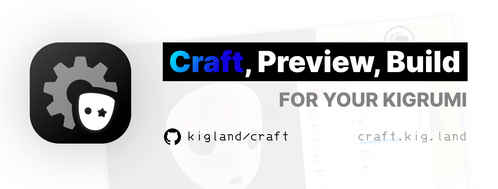
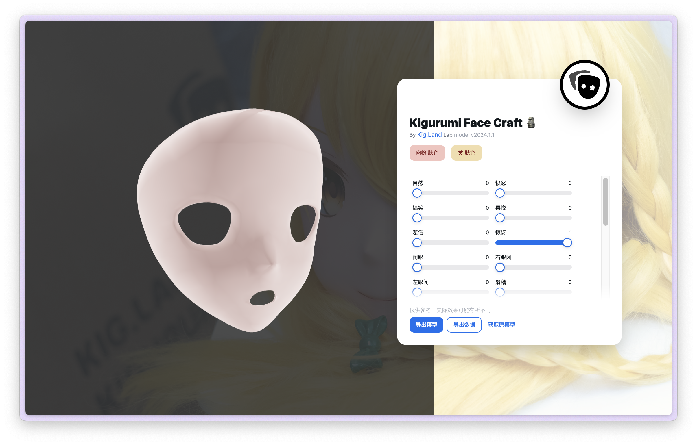
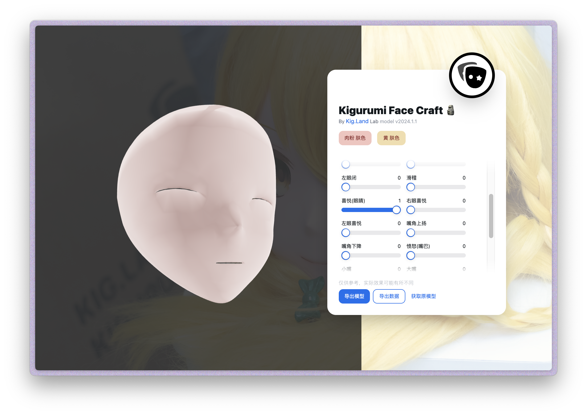

# [Craft](https://craft.kig.land) - Kigurumi first, A light-weight online face editor for Kigurumi Cosplay Character Customizer

## Overview

> We aim to create a tool for KIGURUMI customization that is online and accessible to everyone, requiring no prior knowledge of modeling.

Craft is a toolkit for Kigurumi base model customization. It is a web-based application that allows users to customize their Kigurumi base model with a variety of options. The application is designed to be user-friendly and accessible to everyone, requiring no prior knowledge of modeling. The application is built using React, TypeScript, Threejs and Vite.

## Motivation

Kigurumi is a type of cosplay that involves wearing a mask and a bodysuit to represent a specific character. The bodysuit is often custom-made to fit the wearer's body, and the mask is often custom-made to fit the wearer's face. The process of creating a custom Kigurumi mask is time-consuming and requires a lot of skill and knowledge of 3D modeling. We aim to create a tool for Kigurumi customization that is online and accessible to everyone, requiring no prior knowledge of modeling.

## Features

- [x] Model Customization
- [x] Apply customization result && Model Export (to `.stl`)
- [x] Model data export (to `.json`)

## License

[GPL-2.0](./LICENSE) (source code only, assets may have different licenses)

## Screenshots

